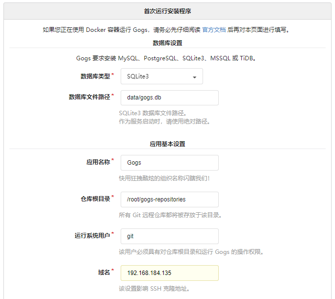
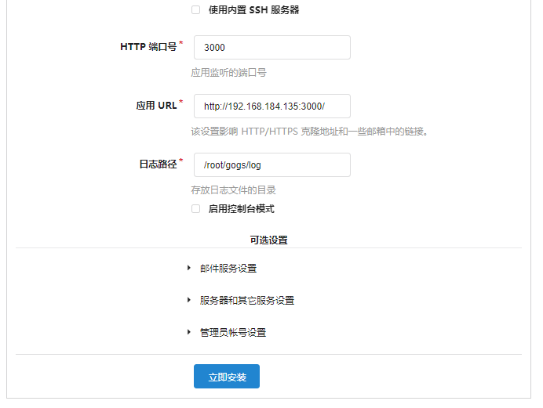
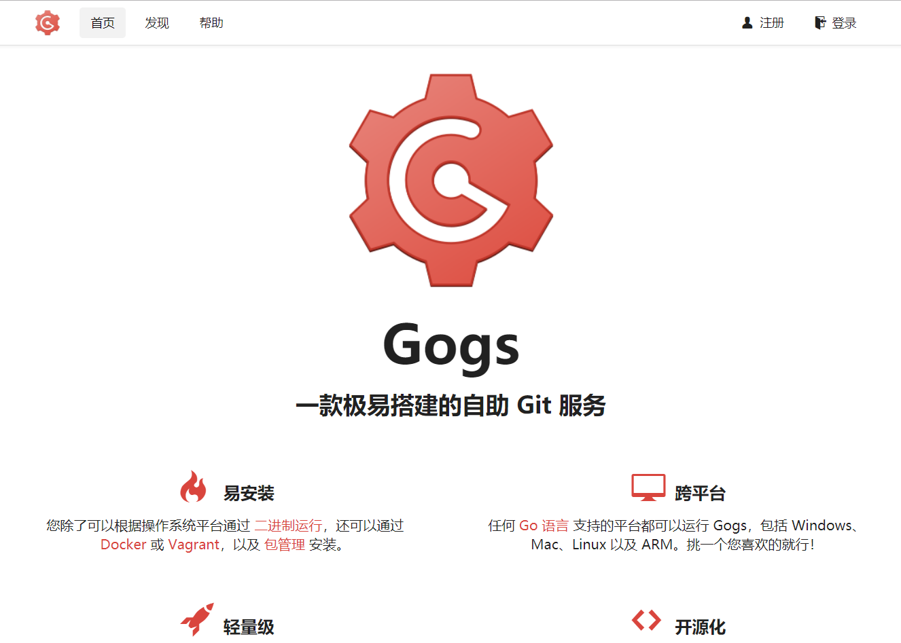
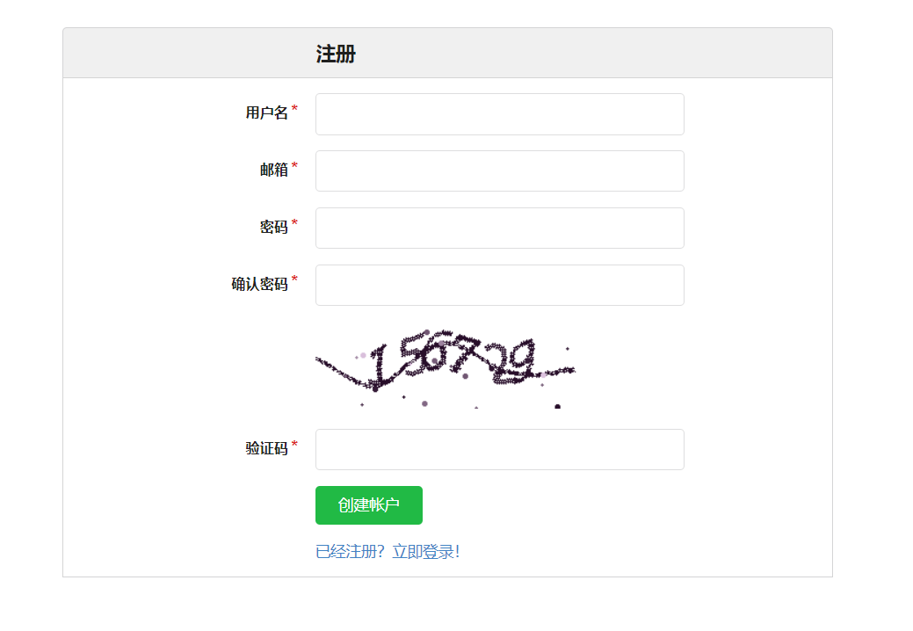
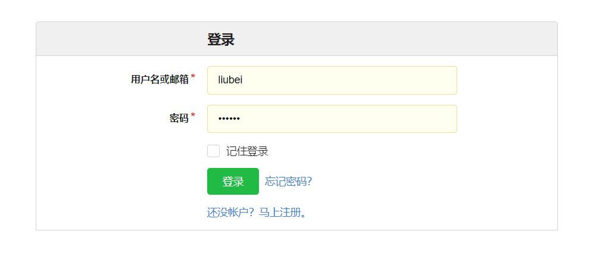
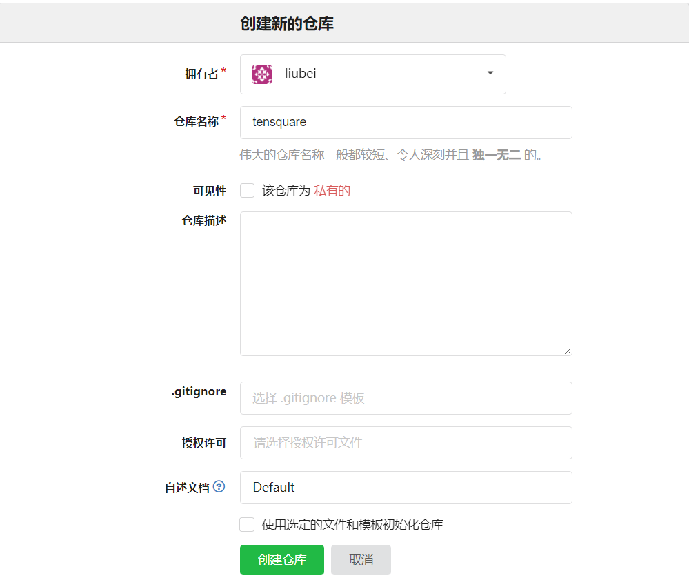
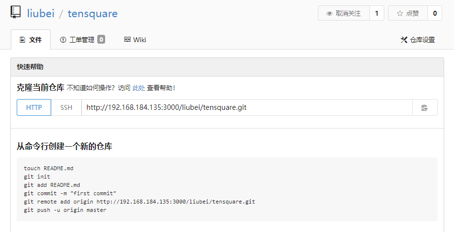

# 什么是持续集成

​	持续集成   Continuous integration ，简称CI	

​	随着软件开发复杂度的不断提高，团队开发成员间如何更好地协同工作以确保软件开发的质量已经慢慢成为开发过程中不可回避的问题。尤其是近些年来，敏捷（Agile） 在软件工程领域越来越红火，如何能再不断变化的需求中快速适应和保证软件的质量也显得尤其的重要。

​	持续集成正是针对这一类问题的一种软件开发实践。它倡导团队开发成员必须经常集成他们的工作，甚至每天都可能发生多次集成。而每次的集成都是通过自动化的构建来验证，包括自动编译、发布和测试，从而尽快地发现集成错误，让团队能够更快的开发内聚的软件。

持续集成具有的特点：

- 它是一个自动化的周期性的集成测试过程，从检出代码、编译构建、运行测试、结果记录、测试统计等都是自动完成的，无需人工干预；
- 需要有专门的集成服务器来执行集成构建；
- 需要有代码托管工具支持，我们下一小节将介绍Git以及可视化界面Gogs的使用


持续集成的作用：

- 保证团队开发人员提交代码的质量，减轻了软件发布时的压力；
- 持续集成中的任何一个环节都是自动完成的，无需太多的人工干预，有利于减少重复过程以节省时间、费用和工作量；


# Jenkins简介

​	Jenkins，原名Hudson，2011年改为现在的名字，它 是一个开源的实现持续集成的软件工具。官方网站：[http://jenkins-ci.org/](http://jenkins-ci.org/)。

​	Jenkins 能实施监控集成中存在的错误，提供详细的日志文件和提醒功能，还能用图表的形式形象地展示项目构建的趋势和稳定性。

​	特点：

- 易安装：仅仅一个 java -jar jenkins.war，从官网下载该文件后，直接运行，无需额外的安装，更无需安装数据库；
- 易配置：提供友好的GUI配置界面；
- 变更支持：Jenkins能从代码仓库（Subversion/CVS）中获取并产生代码更新列表并输出到编译输出信息中；
- 支持永久链接：用户是通过web来访问Jenkins的，而这些web页面的链接地址都是永久链接地址，因此，你可以在各种文档中直接使用该链接；
- 集成E-Mail/RSS/IM：当完成一次集成时，可通过这些工具实时告诉你集成结果（据我所知，构建一次集成需要花费一定时间，有了这个功能，你就可以在等待结果过程中，干别的事情）；
- JUnit/TestNG测试报告：也就是用以图表等形式提供详细的测试报表功能；
- 支持分布式构建：Jenkins可以把集成构建等工作分发到多台计算机中完成；
- 文件指纹信息：Jenkins会保存哪次集成构建产生了哪些jars文件，哪一次集成构建使用了哪个版本的jars文件等构建记录；
- 支持第三方插件：使得 Jenkins 变得越来越强大


# Jenkins安装

## JDK安装

（1）将jdk-8u171-linux-x64.rpm上传至服务器（虚拟机）

（2）执行安装命令

```
rpm -ivh jdk-8u171-linux-x64.rpm
```

RPM方式安装JDK，其根目录为：/usr/java/jdk1.8.0_171-amd64

## Jenkins安装与启动 

（1）下载jenkins

```
wget https://pkg.jenkins.io/redhat/jenkins-2.83-1.1.noarch.rpm
```

或将jenkins-2.83-1.1.noarch.rpm上传至服务器

（2）安装jenkins

```
rpm -ivh jenkins-2.83-1.1.noarch.rpm
```

（3）配置jenkins

```
vi /etc/sysconfig/jenkins
```

修改用户和端口

```
JENKINS_USER="root"
JENKINS_PORT="8888"
```

（4）启动服务

```
systemctl start jenkins
```

（5）访问链接 http://127.0.0.1:8888

从/var/lib/jenkins/secrets/initialAdminPassword中获取初始密码串 


（6）安装插件  


 


（7）新建用户


完成安装进入主界面


# Jenkins插件安装

我们以安装maven插件为例，演示插件的安装

（1）点击左侧的“系统管理”菜单 ,然后点击


（2）选择“可选插件”选项卡，搜索maven，在列表中选择Maven Integration  ，点击“直接安装”按钮


看到如下图时，表示已经完成


# 全局工具配置

## 安装Maven与本地仓库

（1）将Maven压缩包上传至服务器（虚拟机）

（2）解压

```
tar zxvf apache-maven-3.5.4-bin.tar.gz
```

（3）移动目录

```
mv apache-maven-3.5.4 /usr/local/maven
```

（4）编辑setting.xml配置文件`vi /usr/local/maven/conf/settings.xml `，配置本地仓库目录,内容如下

```
<localRepository>/usr/local/repository</localRepository>
```

（5）将开发环境的本地仓库上传至服务器（虚拟机）并移动到/usr/local/repository   。

```
mv reponsitory_boot /usr/local/repository
```

执行此步是为了以后在打包的时候不必重新下载，缩短打包的时间。

## 全局工具配置

选择系统管理，全局工具配置

（1）JDK配置


设置javahome为 /usr/java/jdk1.8.0_171-amd64

（2）Git配置   （本地已经安装了Git软件）


（3）Maven配置


# 代码上传至Git服务器

## Gogs搭建与配置 

Gogs 是一款极易搭建的自助 Git 服务。

Gogs 的目标是打造一个最简单、最快速和最轻松的方式搭建自助 Git 服务。使用 Go 语言开发使得 Gogs 能够通过独立的二进制分发，并且支持 Go 语言支持的 **所有平台**，包括 Linux、Mac OS X、Windows 以及 ARM 平台。

地址：https://gitee.com/Unknown/gogs

（1）下载镜像

```
docker pull gogs/gogs
```

（2）创建容器

```
docker run -di --name=gogs -p 10022:22 -p 3000:3000 -v /var/gogsdata:/data gogs/gogs
```

（3）假设我的centos虚拟机IP为192.168.184.141   在地址栏输入http://192.168.184.141:3000  会进入首次运行安装程序页面，我们可以选择一种数据库作为gogs数据的存储，最简单的是选择SQLite3。如果对于规模较大的公司，可以选择MySQL  



 

点击“立即安装”

这里的域名要设置为centos的IP地址,安装后显示主界面



（4）注册



（5）登录



（6）创建仓库 




## 提交代码

步骤：

（1）在本地安装git(Windows版本)

（2）在IDEA中选择菜单 :  File -- settings ,  在窗口中选择Version Control --  Git


（3）选择菜单VCS  --> Enable Version Control Integration... 


选择Git

（4）设置远程地址:  右键点击工程选择菜单    Git --> Repository   -->Remotes...


（5）右键点击工程选择菜单    Git --> Add

（6）右键点击工程选择菜单    Git --> Commit Directory...

（7）右键点击工程选择菜单    Git --> Repository   --> Push ...


# 任务的创建与执行 

（1）回到首页，点击新建按钮 .如下图，输入名称，选择创建一个Maven项目，点击OK


（2）源码管理，选择Git


（3）Build


命令:

```
clean package docker:build -DpushImage
```

用于清除、打包，构建docker镜像

最后点击“保存”按钮

（4）执行任务

