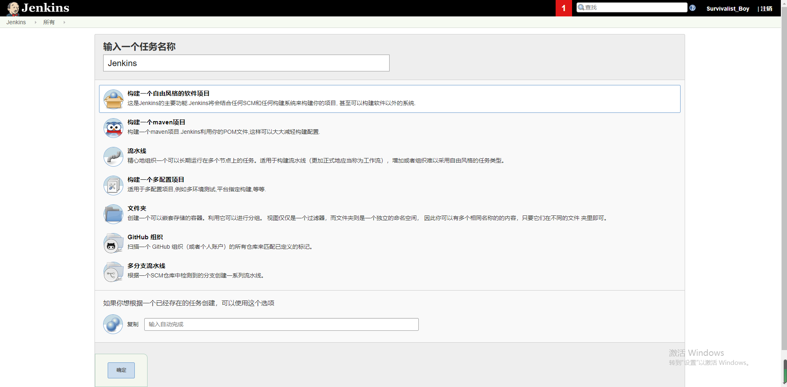
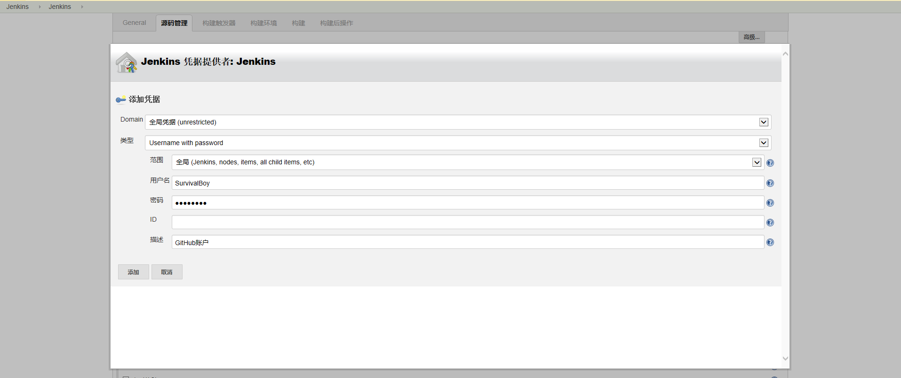
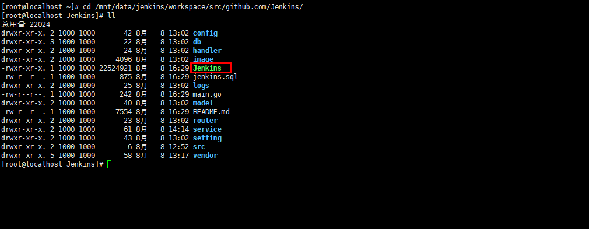

[TOC]
# 什么是持续集成

​	持续集成   Continuous integration ，简称CI	

​	随着软件开发复杂度的不断提高，团队开发成员间如何更好地协同工作以确保软件开发的质量已经慢慢成为开发过程中不可回避的问题。尤其是近些年来，敏捷（Agile） 在软件工程领域越来越红火，如何能在不断变化的需求中快速适应和保证软件的质量也显得尤其的重要。

​	持续集成正是针对这一类问题的一种软件开发实践。它倡导团队开发成员必须经常集成他们的工作，甚至每天都可能发生多次集成。而每次的集成都是通过自动化的构建来验证，包括自动编译、发布和测试，从而尽快地发现集成错误，让团队能够更快的开发内聚的软件。

持续集成具有的特点：

- 它是一个自动化的周期性的集成测试过程，从检出代码、编译构建、运行测试、结果记录、测试统计等都是自动完成的，无需人工干预；
- 需要有专门的集成服务器来执行集成构建；
- 需要有代码托管工具支持，例如Git以及可视化界面Gogs的使用


持续集成的作用：

- 保证团队开发人员提交代码的质量，减轻了软件发布时的压力；
- 持续集成中的任何一个环节都是自动完成的，无需太多的人工干预，有利于减少重复过程以节省时间、费用和工作量；


# Jenkins简介

​	Jenkins，原名Hudson，2011年改为现在的名字，它 是一个开源的实现持续集成的软件工具。官方网站：[http://jenkins-ci.org/](http://jenkins-ci.org/)。

​	Jenkins 能实施监控集成中存在的错误，提供详细的日志文件和提醒功能，还能用图表的形式形象地展示项目构建的趋势和稳定性。

​	特点：

- 易安装：仅仅两个docker命令即可从官网下载直接运行，无需额外的安装，更无需安装数据库；
- 易配置：提供友好的GUI配置界面；
- 变更支持：Jenkins能从代码仓库（Subversion/CVS）中获取并产生代码更新列表并输出到编译输出信息中；
- 支持永久链接：用户是通过web来访问Jenkins的，而这些web页面的链接地址都是永久链接地址，因此，你可以在各种文档中直接使用该链接；
- 集成E-Mail/RSS/IM：当完成一次集成时，可通过这些工具实时告诉你集成结果（据我所知，构建一次集成需要花费一定时间，有了这个功能，你就可以在等待结果过程中，干别的事情）；
- JUnit/TestNG测试报告：也就是用以图表等形式提供详细的测试报表功能；
- 支持分布式构建：Jenkins可以把集成构建等工作分发到多台计算机中完成；
- 文件指纹信息：Jenkins会保存哪次集成构建产生了哪些jars文件，哪一次集成构建使用了哪个版本的jars文件等构建记录；
- 支持第三方插件：使得 Jenkins 变得越来越强大

# Jenkins安装与启动 

（1）执行安装命令,下载jenkins

```
docker pull jenkins/jenkins
```


（2）启动服务

```
docker run -p 8080:8080 -p 50000:50000 -v /mnt/data/jenkins:/var/jenkins_home --name "jenkins" jenkins/jenkins
```


若报错如下:

```
touch: cannot touch ‘/var/jenkins_home/copy_reference_file.log’: Permission denied
Can not write to /var/jenkins_home/copy_reference_file.log. Wrong volume permissions?
```

需要修改下目录权限, 因为当映射本地数据卷时，/mnt/data/jenkins目录的拥有者为root用户，而容器中jenkins user的uid为1000

```
sudo chown -R 1000:1000 /mnt/data/jenkins
```

（3）访问链接 http://10.20.29.151:8080

> 若密码忘记，可进入容器，执行`cat /var/lib/jenkins/secrets/initialAdminPassword`获取初始密码串。  
> 若目录不存在，可使用`find / -name "initialAdminPassword" -depth -print`命令查找。


（4）安装插件  


（5）新建用户


完成安装进入主界面


# Jenkins插件安装

我们以安装maven插件为例，演示插件的安装

（1）点击左侧的“系统管理”菜单 ,然后点击


（2）选择“可选插件”选项卡，搜索maven，在列表中选择Maven Integration  ，点击“直接安装”按钮


看到如下图时，表示已经完成


> 注:如果你的项目是GitHub、GitLib或是Go语言等项目，那么我想你都需要这么一个对应的插件来帮你干活。

# 全局工具配置

选择系统管理，全局工具配置


## 自动安装

Jenkins提供了两种工具配置的方式，我们还是以maven为例


第一种如上图，只需要选择自动安装和版本号就可以，同时Jenkins在右上角给出了一个解疑按键，可以通过该键看到说明和示例。

## 本地安装
相较于第一种方式，第二种方式相对麻烦一些，但好处是可以在以后打包的时候不必重新下载，缩短打包的时间。

下面就来教大家如何安装Maven与本地仓库：

（1）将Maven压缩包上传至服务器（虚拟机）

（2）解压

```
tar zxvf apache-maven-3.5.4-bin.tar.gz
```

（3）移动目录

```
mv apache-maven-3.5.4 /usr/local/maven
```

（4）编辑setting.xml配置文件`vi /usr/local/maven/conf/settings.xml `，配置本地仓库目录,内容如下

```
<localRepository>/usr/local/repository</localRepository>
```

（5）将开发环境的本地仓库上传至服务器（虚拟机）并移动到/usr/local/repository   。

```
mv reponsitory_boot /usr/local/repository
```
其他示例:

（1）JDK配置


设置javahome为 /usr/java/jdk1.8.0_171-amd64

（2）Git配置   （本地已经安装了Git软件）


（3）Maven配置


# 代码上传至Git服务器

步骤：

（1）在本地安装git(Windows版本)

（2）在IDEA中选择菜单 :  File -- settings ,  在窗口中选择Version Control --  Git


（3）选择菜单VCS  --> Enable Version Control Integration... 


选择Git

（4）设置远程地址:  右键点击工程选择菜单    Git --> Repository   -->Remotes...


（5）右键点击工程选择菜单    Git --> Add

（6）右键点击工程选择菜单    Git --> Commit Directory...

（7）右键点击工程选择菜单    Git --> Repository   --> Push ...


# 任务的创建与执行 
我们以最火的Java项目和Go项目为例，给大家分别演示如何构建项目和执行

## Go项目
（1）回到首页，点击新建按钮 .如下图，输入名称，选择创建一个自由风格的项目，点击OK



（2）General管理，可以添加项目描述和GitHub项目路径，以及一些配置


（3）源码管理，选择GitHub





（4）构建触发器，配置触发规则，这里以定时和轮询为示例，配别设置为


定时构建：定时构建1次任务

轮询SCM:定时查看源码管理的代码是否更新，有更新则构建，否则不会构建

如图所示，定时构建为每间隔10分钟定时构建一次，轮询SCM为每5分钟轮询检测一次。  

>时间*号规则为: 分 时 日 月 周  

（5）构建环境，配置控制台输出时间戳和指定Go语言版本


（6）构建，使用Shell脚本测试代码上传后的项目是否有效


Shell如下:

```
export GOPATH=$WORKSPACE/../                    # 指定GOPATH路径，Go语言执行必须有GOPATH路径
export GOWORK=$GOPATH/src/github.com/Jenkins    # 创建项目执行时的目录依赖结构
cp -rf $WORKSPACE/* $GOWORK/                    # 使测试运行数据和源数据隔离
cd $GOWORK && go build                          # 进入项目目录并执行
```

命令解说：  
> `$GOPATH`   Go 运行需要指定 GOPATH 也即项目运行路径  
> `$WORKSPACE` /var/jenkins_home/workspace/Jenkins  
> `GOWORK` 创建符合代码依赖的执行目录  
> 注:下载Go的插件在构建时，会自动为我们设置GOROOT,但不会指定GOPATH，因此需要指定

最后点击“保存”按钮

（7）执行构建，控制台查看输出


构建成功，也输出了WORKSPACE、GOPATH、GOROOT目录，说明配置生效。进入docker容器或是挂载目录查看是否有可执行文件：



除了上述方法，也可以通过shell配置docker等方式构建、部署、运行项目，还可以将项目配置到当前/其他服务器运行，更多配置方式就不一一陈述了，请自行挖掘。

## JAVA项目
（1）回到首页，点击新建按钮 .如下图，输入名称，选择创建一个Maven项目，点击OK


（2）源码管理，选择Git


（3）Build


命令:

```
clean package docker:build -DpushImage
```

用于清除、打包，构建docker镜像

最后点击“保存”按钮

（4）执行任务

后续请参照Go项目的执行步骤。